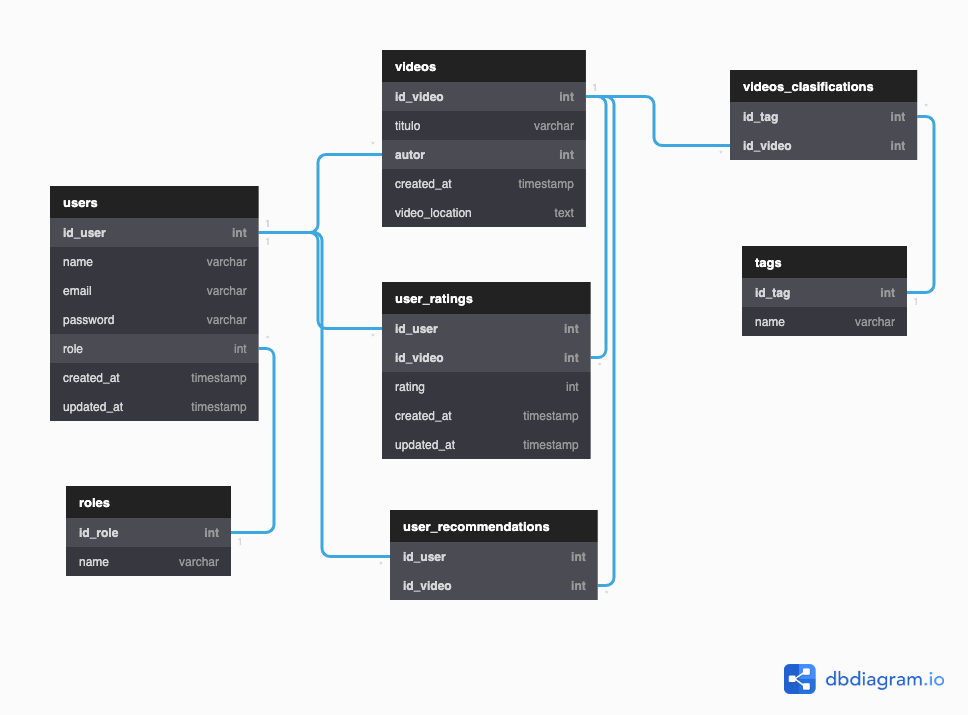

# SongCloud

## Autores:
- Diego Avila Morales
- Manuel Martin Rico
- Miguel Ángel Quiñones Ramírez
- Carlos Alejandro Pool Quintal

## Documento de Arquitectura de Software

## Índice
- [SongCloud](#songcloud)
  - [Autores:](#autores)
  - [Documento de Arquitectura de Software](#documento-de-arquitectura-de-software)
  - [Índice](#índice)
  - [Introducción](#introducción)
    - [Propósito](#propósito)
    - [Alcance](#alcance)
    - [Documentos de referencia](#documentos-de-referencia)
  - [Arquitectura](#arquitectura)
    - [Descripción de la arquitectura utilizada (Capas)](#descripción-de-la-arquitectura-utilizada-capas)
    - [Definición teórica de Microservicios](#definición-teórica-de-microservicios)
    - [Diagrama de arquitectura con descripción](#diagrama-de-arquitectura-con-descripción)
    - [Diagrama de secuencia para los procesos descritos en la descripción de la App 1 y la App 2](#diagrama-de-secuencia-para-los-procesos-descritos-en-la-descripción-de-la-app-1-y-la-app-2)
    - [Diagrama de la base de datos](#diagrama-de-la-base-de-datos)
    - [Descripción de las entidades](#descripción-de-las-entidades)
    - [Diagrama entidad-relación](#diagrama-entidad-relación)
  - [Documentación de la API (Aquí le entra el POSTMAN)](#documentación-de-la-api-aquí-le-entra-el-postman)
  - [Criterios de calidad](#criterios-de-calidad)

---

## Introducción

>  Una introducción (Creo que no es necesario el texto aquí, pero si en los subindices)

### Propósito

>  Un propósito

### Alcance

>  Un alcance

### Documentos de referencia

>  Documentos de referencia
>  Utilice esta vaina para lo de microservicios https://microservices.io/ 
>  También esta https://www.redhat.com/es/topics/microservices/what-are-microservices

---

## Arquitectura

### Descripción de la arquitectura utilizada (Capas)

> Descripción de la arquitectura

### Definición teórica de Microservicios

> Definición de los Microservicios

Los microservicios se tratan de un estilo arquitectónico mediante el cual una aplicación se estructura en función a una colección de **servicios** que deben ser:
* Altamente mantenibles y probables
* Débilmente acoplados
* Independientes en su despliegue
* Organizados de acuerdo a las capacidades de la empresa
* Liderados por un equipo de desarrollo pequeño

Esto quiere decir que permite un despliegue rápido, frecuente y confiable de aplicaciones grandes y complejas. Es un elemento fundamental de la optimización del desarrollo de aplicaciones hacia un modelo nativo de la **nube**.

Cada función se denomina servicio y se puede diseñar e implementar de forma independiente. Es más, desarrollar utilizando este estilo arquitectónico provee beneficios como:
* Aplicaciones más rápidas para comercializarse
* Gran capacidad de expansión
* Capacidad de recuperación 
* Facilidad de implementación
* Accesibilidad para los desarrolladores
* Aplicaciones más abiertas

### Diagrama de arquitectura con descripción

> Diagrama de la arquitectura con sus respectivas descripción

### Diagrama de secuencia para los procesos descritos en la descripción de la App 1 y la App 2

> Diagrama de secuencias

### Diagrama de la base de datos

### Descripción de las entidades

Para una descripción más precisa de las entidades involucradas en la base de datos, se anexa a continuación el siguiente documento de [diseño de la base de datos](https://docs.google.com/document/d/1nUIwVgMMC-rgfiYJIb37Z4NiLlI71eAl7fttU49Pfq0/edit?usp=sharing)

### Diagrama entidad-relación

---

## Documentación de la API (Aquí le entra el POSTMAN)

> Aquí metemos un buen y rico POSTMAN (Si es posible)

---

## Criterios de calidad

> Para los criterios de calidad de acuerdo a la ISO/IEC

- Funcionalidad
- Portabilidad
- Mantenibilidad
- Eficiencia
- Usabilidad
- Confiabilidad